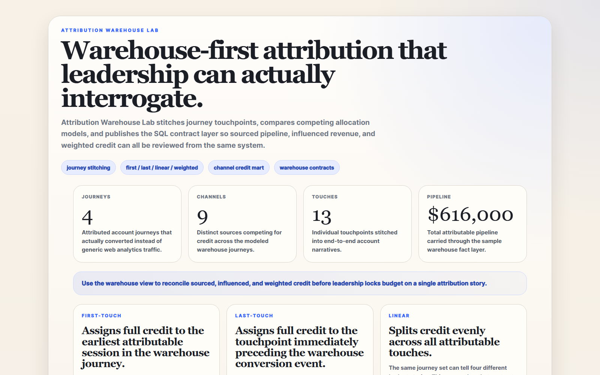
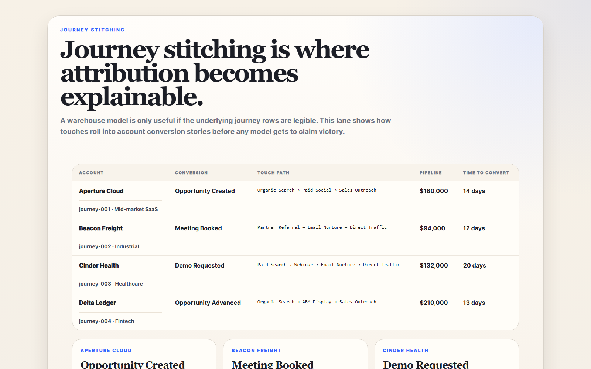
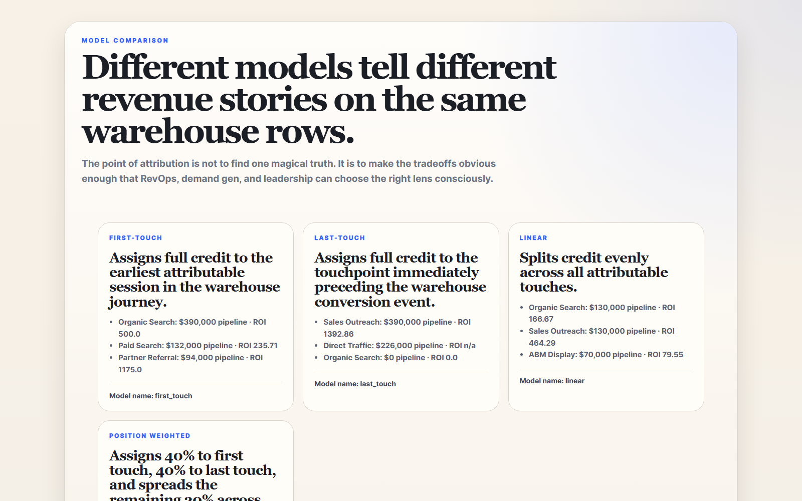
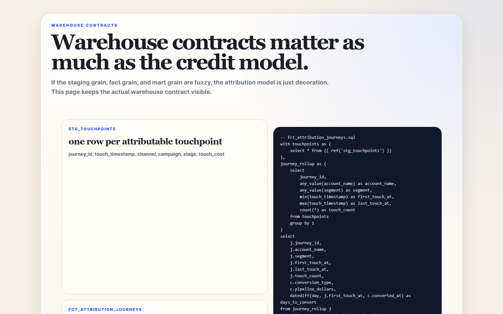

# Attribution Warehouse Lab

Warehouse-first attribution lab for **journey stitching, channel credit modeling, weighted allocation, and SQL-visible revenue reconciliation**.

> **What this repo proves**
>
> Attribution gets more useful when it stops being a chart argument and starts being a warehouse contract with inspectable journey rows and model outputs.

## Why this repo exists

Most attribution debates fail for predictable reasons:

- journeys are not stitched cleanly
- sourced and influenced pipeline get mixed together
- leadership sees one favored model but not the alternatives
- SQL logic is hidden behind dashboards instead of being reviewable

`attribution-warehouse-lab` models the warehouse layer directly. It keeps touchpoint journeys, conversion rows, channel credit models, and SQL assets visible in one small local-first repo.

## Screenshots






## What it includes

- FastAPI service with HTML proof surfaces and JSON APIs
- sample warehouse-friendly journey dataset
- first-touch, last-touch, linear, and position-weighted channel allocation models
- SQL model assets for staging, fact, and mart layers
- real PNG screenshots generated from repo-owned HTML scenes
- tests, CI, and one-command local validation

## Local Run

```powershell
cd attribution-warehouse-lab
py -3.11 -m venv .venv
.\.venv\Scripts\python.exe -m pip install -r requirements.txt
.\.venv\Scripts\python.exe -m app.main
```

Open:

- [http://127.0.0.1:5034/](http://127.0.0.1:5034/)
- [http://127.0.0.1:5034/journeys](http://127.0.0.1:5034/journeys)
- [http://127.0.0.1:5034/models](http://127.0.0.1:5034/models)
- [http://127.0.0.1:5034/warehouse](http://127.0.0.1:5034/warehouse)
- [http://127.0.0.1:5034/docs](http://127.0.0.1:5034/docs)

If that port is occupied:

```powershell
$env:PORT = "5038"
.\.venv\Scripts\python.exe -m app.main
```

## Validation

```powershell
.\.venv\Scripts\python.exe -m unittest discover -s tests
.\.venv\Scripts\python.exe scripts\run_demo.py
.\.venv\Scripts\python.exe scripts\smoke_check.py
.\.venv\Scripts\python.exe scripts\render_readme_assets.py
```

## API routes

- `GET /api/dashboard/summary`
- `GET /api/journeys`
- `GET /api/models`
- `GET /api/contracts`
- `GET /api/sample`

## Repo layout

- `app/main.py`
- `app/services/attribution_service.py`
- `warehouse/models/`
- `scripts/`
- `tests/`
